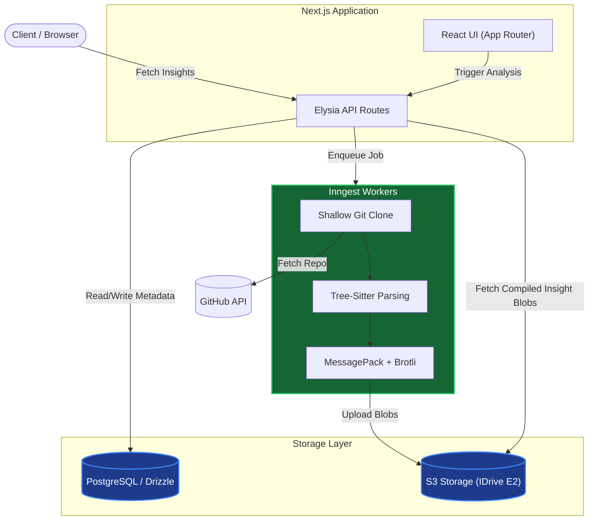

# Git Insights Analyzer

A deep repository analyzer built on the T3 Stack. It provides structural analysis, hotspot detection, and visual insights into your GitHub repositories.

**Repository:** [https://github.com/Its-Satyajit/git-insights-analyzer](https://github.com/Its-Satyajit/git-insights-analyzer)

---

## Features

- **Modern Dashboard**: A high-performance dashboard using TanStack Query and Virtualization for large repo trees.
- **Deep Analysis**:
  - **Dependency Graph**: Understand how files connect using Tree-sitter powered parsing.
  - **Hotspot Detection**: Identify complex areas with high churn/loc/dependency weights.
  - **FileType Distribution**: Visual breakdown of your codebase composition.
- **Virtualized Treemaps**: Navigate entire repositories with D3-powered squarified treemaps.
- **Hybrid File Viewing**: Secure previews for both public and private GitHub files with Shiki syntax highlighting.
- **Async Worker Pipeline**: Industrial-grade analysis queue powered by Inngest.

## Tech Stack

- **Framework**: Next.js (App Router, Server Actions)
- **Styling**: Tailwind CSS, shadcn/ui
- **Database**: PostgreSQL with Drizzle ORM
- **Auth**: Better-Auth
- **Backend Logic**: Elysia (Server Logic), Inngest (Background Jobs)
- **Storage**: S3 API (IDrive E2) for large AST blobs, PostgreSQL for metadata
- **Parsers**: Tree-sitter (via WASM)
- **Visuals**: D3.js, Recharts, Framer Motion

## Architecture & Data Flow

This application is built defensively to prevent database bloating by offloading heavy computational objects (parsed ASTs, dependency graphs) into compressed Blob storage.



## Getting Started

### 1. Prerequisites

- Node.js (Latest LTS)
- pnpm
- PostgreSQL
- S3 Compatible Object Storage (e.g., IDrive E2)

### 2. Environment Setup

Copy .env.example to .env and fill in your credentials:

```bash
cp .env.example .env
```

Key required variables:
- GITHUB_TOKEN: A Personal Access Token for GitHub API access.
- DATABASE_URL: Your PostgreSQL connection string.
- S3 API Keys: Your access keys for object storage.
- INNGEST_EVENT_KEY: Your specific event key from Inngest.

### 3. Installation

```bash
pnpm install
```

### 4. Running the App

```bash
pnpm dev
```

The app will be available at http://localhost:3000.

## License

Distributed under the MIT License. See LICENSE for more information.

---

Built for the open-source community by Satyajit.
